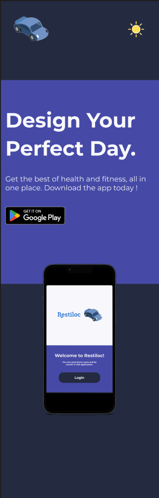

  
  
  

    Make it easy for you ❤️
  

<a href="https://github.com/Restiloc/docs"><strong>Documentation »</strong></a>

<h4>
    <a href="https://restiloc.github.io/landing/">Go to the site</a>
   · 
    <a href="https://github.com/Restiloc/restiloc">Report a bug</a>
   · 
    <a href="https://github.com/Restiloc/restiloc">I have an idea</a>
  </h4>

 

# :notebook_with_decorative_cover: Summary

- [:space\_invader: Techs](#space_invader-techs)
- [:mag_right: Design](mag_right-design)
- [:wave: Contributors](#wave-contributors)

## :space_invader: Techs

## :mag_right: Design

  ### Branding
  
  

  ### Landing page

  #### Desktop
  
  

  #### Responsive
  
  

  ### Mobile

  #### Welcome / Login
  
  
  
  #### Application UI

  

  #### Navigation / Settings
  
  

## :wave: Contributors

* **Sara Melais** _alias_ [@SaraMLS](https://github.com/SaraMLS)
* **Alexis Henry** _alias_ [@AlxisHenry](https://github.com/AlxisHenry)

<!-- ## :page_with_curl: Liens utiles -->

(<a href="#readme-top">back to top</a>)

